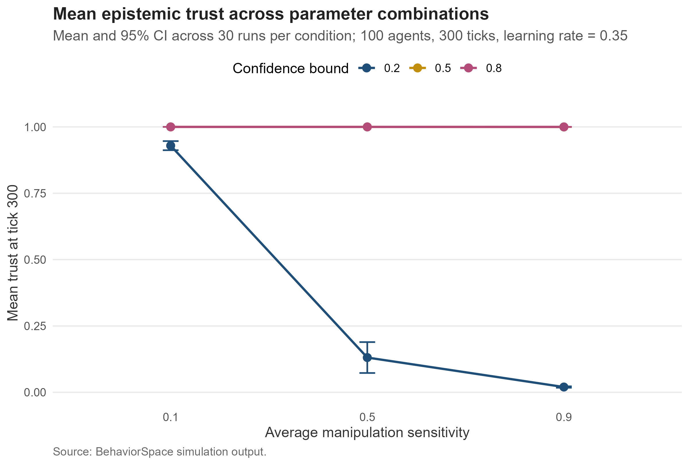
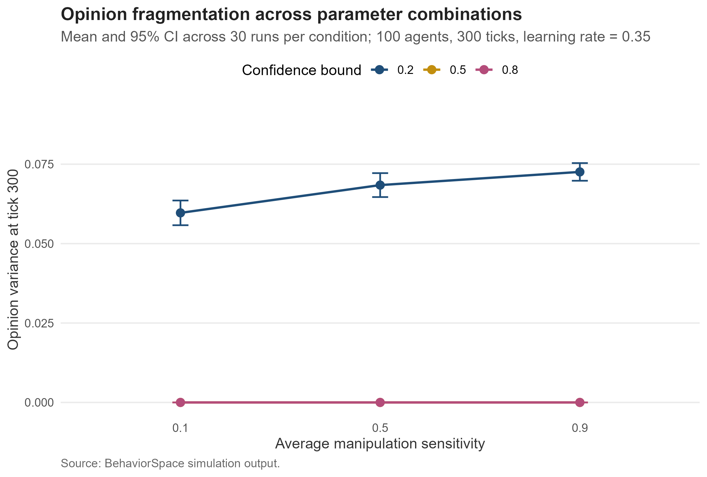

# Perceived Manipulation and Epistemic Trust

This repository contains a small exploratory agent-based model of how perceived manipulation can affect epistemic trust and opinion updating. The model asks:

> Under what conditions does perceived manipulation erode interpersonal epistemic trust and inhibit opinion updating across disagreement?

The project was developed as a proof of concept in NetLogo, tested through a 270-run BehaviorSpace experiment, and analysed in R. It is a theoretical simulation, not an empirically calibrated model of citizen behaviour.

## Theoretical motivation

The model is motivated by Elizabeth Anderson's Deweyan account of epistemic democracy, in which disagreement and cognitive diversity can support collective learning and error correction. It uses bounded-confidence opinion dynamics as its computational starting point: citizens update their opinions only when disagreement falls within an acceptable range.

The model introduces perceived manipulation as a mechanism that can interrupt this learning process. When disagreement is interpreted as manipulative, trust declines and no opinion update occurs. Repeated interactions can therefore produce a feedback loop between perceived manipulation, declining trust, reduced learning, and persistent disagreement.

Fricker's theory of testimonial injustice informs the broader interest in unequal credibility judgments. The present model does not yet assign social identities or identity-based credibility deficits, so it should not be interpreted as a direct computational implementation of testimonial injustice.

## Model design

Each citizen has three state variables:

- `opinion`: a position between 0 and 1;
- `trust`: a general propensity to treat others as useful epistemic partners;
- `manipulation-sensitivity`: the likelihood of interpreting disagreement as attempted manipulation.

At setup, opinions are drawn randomly from a uniform distribution, trust is set to `0.8`, and all citizens receive the manipulation-sensitivity selected in the interface. During each tick, every citizen interacts with one randomly selected partner.

For an interaction between citizen *i* and partner *j*, disagreement is:

```text
|opinion_i - opinion_j|
```

The probability that citizen *i* perceives manipulation is:

```text
min(1, manipulation-sensitivity_i × disagreement)
```

If manipulation is perceived, the citizen's trust decreases by `0.08`, and no opinion update occurs. Otherwise, the citizen updates only when disagreement is within the confidence bound:

```text
opinion_i ← opinion_i
            + learning-rate × trust_i × (opinion_j - opinion_i)
```

An accepted update increases trust by `0.01`, up to a maximum of 1. Each simulation ends after 300 ticks.

### Parameters

| Parameter | Meaning | Interface default |
|---|---|---:|
| `population` | Number of citizens | 100 |
| `average-manipulation-sensitivity` | Sensitivity to perceived manipulation | 0.50 |
| `confidence-bound` | Maximum disagreement permitting an update | 0.20 |
| `learning-rate` | Size of an accepted opinion update | 0.35 |

### Outcomes

| Measure | Definition |
|---|---|
| `mean-trust` | Mean trust across citizens |
| `opinion-fragmentation` | Variance of citizens' opinions |
| `manipulation-rate` | Share of interactions interpreted as manipulation |
| `update-rate` | Share of interactions resulting in opinion updates |

## BehaviorSpace experiment

The experiment varies manipulation sensitivity and the confidence bound, holding the population and learning rate constant.

| Setting | Values |
|---|---|
| Manipulation sensitivity | 0.10, 0.50, 0.90 |
| Confidence bound | 0.20, 0.50, 0.80 |
| Learning rate | 0.35 |
| Population | 100 |
| Duration | 300 ticks |
| Repetitions | 30 per parameter combination |
| Total runs | 270 |

Metrics are recorded at the final tick. The R script checks the number of runs, repetitions per experimental cell, final ticks, duplicates, and missing values before producing descriptive summaries, 95% confidence intervals, factorial ANOVA tables, and interaction plots.

## Results

The strongest relationship appears when the confidence bound is narrow (`0.20`).

| Manipulation sensitivity | Mean trust | Opinion fragmentation | Manipulation rate | Update rate |
|---:|---:|---:|---:|---:|
| 0.10 | 0.929 | 0.060 | 0.025 | 0.483 |
| 0.50 | 0.131 | 0.068 | 0.136 | 0.456 |
| 0.90 | 0.020 | 0.073 | 0.267 | 0.412 |

Higher manipulation sensitivity is associated with lower trust, fewer accepted updates, and greater opinion fragmentation under a narrow confidence bound. With confidence bounds of `0.50` or `0.80`, opinions converge rapidly in this model. Disagreement then approaches zero, perceived manipulation becomes rare, and trust recovers toward its maximum.





These results describe the implications of the model's assumptions. They do not provide empirical evidence about actual citizens or democratic institutions.

## Repository structure

```text
perceived-manipulation/
├── README.md
├── perceived-manipulation.Rproj
├── model/
│   └── perceived_manipulation.nlogox
├── analysis/
│   └── analyse_behaviorspace_results.R
├── data/
│   └── behaviorspace_results.csv
├── results/
│   ├── cell_counts.csv
│   ├── data_quality_summary.csv
│   ├── factorial_anova_results.csv
│   └── summary_by_condition.csv
└── figures/
    ├── Figure_1_mean_trust.png
    └── Figure_2_opinion_fragmentation.png
```

Local RStudio files such as `.Rhistory` and `.Rproj.user/` are excluded from the repository.

## Reproducing the analysis

### Requirements

- NetLogo 7.0.4
- R
- R packages: `dplyr`, `tidyr`, `readr`, and `ggplot2`

### Run the model interactively

1. Open `model/perceived_manipulation.nlogox` in NetLogo.
2. Select the parameter values in the Interface tab.
3. Click `setup` and then `go`.
4. Inspect the monitors and plots as the model runs to tick 300.

### Run the BehaviorSpace experiment

1. In NetLogo, open **Tools → BehaviorSpace**.
2. Select `manipulation-confidence-sweep`.
3. Confirm that the experiment contains 270 runs.
4. Run the experiment and export the table output as `data/behaviorspace_results.csv`.

### Reproduce the summaries and figures

From the repository root, run:

```bash
Rscript analysis/analyse_behaviorspace_results.R \
  data/behaviorspace_results.csv results figures
```

The script writes the statistical summaries to `results/` and the two figures to `figures/`.

## Assumptions and limitations

- Interaction partners are selected randomly; the current model has no fixed social network or homophily.
- Trust is an individual, generalised state rather than a relationship-specific judgment about a particular partner.
- Manipulation is perceived from opinion distance and sensitivity alone. The model does not include actual strategic manipulation, message content, evidence quality, or source identity.
- Manipulation sensitivity is homogeneous within each simulation run.
- The trust loss (`0.08`) and recovery (`0.01`) are theoretical assumptions and have not been empirically calibrated.
- The rapid convergence at wider confidence bounds follows from random mixing and the model's update rule.
- Statistical tests quantify variation within the simulated data; their p-values do not establish relationships in real populations.

Useful extensions include dyadic trust, network structure and homophily, heterogeneous sensitivity, identity-based credibility judgments, strategic manipulators, empirical calibration, and sensitivity analysis of the trust-loss and trust-recovery parameters.

## References

- Anderson, E. (2006). [The epistemology of democracy](https://doi.org/10.3366/epi.2006.3.1-2.8). *Episteme, 3*(1–2), 8–22.
- Fricker, M. (2007). [*Epistemic Injustice: Power and the Ethics of Knowing*](https://doi.org/10.1093/acprof:oso/9780198237907.001.0001). Oxford University Press.
- Hegselmann, R., & Krause, U. (2002). [Opinion dynamics and bounded confidence: Models, analysis and simulation](https://www.jasss.org/5/3/2.html). *Journal of Artificial Societies and Social Simulation, 5*(3).

## Author

Soeun Jeon
